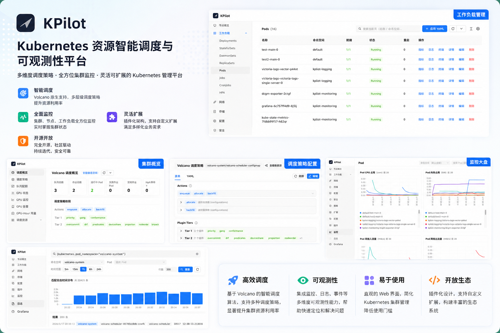

# KPilot

**Unified GPU + model platform for Kubernetes.**

[English](README.md) · [中文](README.zh-CN.md)

<p align="center">
  
</p>

<p align="center">
  <a href="https://github.com/togettoyou/kpilot/blob/main/LICENSE"></a>
  <a href="https://github.com/togettoyou/kpilot/stargazers"></a>
  <a href="https://github.com/togettoyou/kpilot/commits/main"></a>
  
</p>

---

## What is KPilot

KPilot is a control plane for running GPU workloads on Kubernetes. Cluster operations, Volcano-based batch scheduling, vGPU governance, hardware telemetry, plugin lifecycle, and model serving live behind one console with a consistent permission and audit surface.

Multi-cluster is the default — a single KPilot Server manages many clusters, with the in-cluster agent dialing back over gRPC. No inbound ports on the cluster side, no shared kubeconfigs, no per-cloud divergence.

## Architecture

<p align="center">
  
</p>

**Server** owns the UI, API, and durable state (cluster registry, plugin metadata, accounts) but holds no kubeconfigs. **Worker** runs inside each managed cluster, dials the Server over a single long-lived gRPC stream, and brokers every Kubernetes operation on its behalf — no inbound ports, no shared credentials, no cross-cloud divergence. Plugins ship as Helm charts and reconcile via an in-cluster CRD, executing in the cluster's own RBAC context.

## Quick Start

**Install the Server** (control-plane cluster):

```bash
helm install kpilot oci://ghcr.io/togettoyou/charts/kpilot \
  --version 0.0.0-dev \
  --namespace kpilot-system --create-namespace \
  --set server.admin.password='<change-me>'
```

Port-forward the UI and log in with `kpilot` / `<your password>`:

```bash
kubectl -n kpilot-system port-forward svc/kpilot-server 8080:80
open http://localhost:8080
```

**Install the Worker** (each managed cluster). Create a cluster row in the UI, copy the one-time ClusterToken, then:

```bash
helm install kpilot-worker oci://ghcr.io/togettoyou/charts/kpilot \
  --version 0.0.0-dev \
  --namespace kpilot-system --create-namespace \
  --set server.enabled=false,worker.enabled=true,postgresql.enabled=false \
  --set worker.serverAddr='kpilot-server-grpc.kpilot-system.svc:9090' \
  --set worker.clusterToken='<paste-token>'
```

The cluster row in the Server UI transitions to Online within a few seconds. Production exposure (Ingress, external Postgres, image registry mirrors) is covered in [`deploy/README.md`](deploy/README.md).

## Use Cases

- **Multi-cluster GPU operations** — run a single platform team across clusters in different VPCs, regions, or clouds without touching network policies.
- **Shared GPU tenancy** — partition each card into vGPU slices and govern allocation through Volcano queues with explicit capability / guarantee / deserved policies.
- **GPU usage metering** — produce GPU-Hour reports per node and per card straight from DCGM, then drill into hotspots from the same UI.
- **Self-service AI platform** *(roadmap)* — let teams deploy inference endpoints from a model catalog and run distributed fine-tuning without writing YAML.

## Key Features

| | |
|---|---|
| **Cluster Management**<ul><li>Multi-cluster onboarding via a single-use token; no kubeconfig sharing</li><li>Live node and workload browser covering native and custom resources</li><li>In-browser Pod logs, terminal, and per-container CPU / memory metrics</li><li>Inline YAML editor with apply / describe / delete for any resource</li></ul> | **Compute Scheduling**<ul><li>Volcano gang scheduling across Queue, Job, CronJob, PodGroup, HyperNode</li><li>Fine-grained GPU sharing via volcano-vgpu-device-plugin (slot / framebuffer / SM cores)</li><li>Multi-resource queue quotas with capability, guarantee, allocated, and deserved views</li><li>Visual scheduler-policy editor for actions, tiers, and plugin parameters</li></ul> |
| **GPU Observability**<ul><li>Per-card panels for utilization, temperature, power, framebuffer, SM clock, tensor activity</li><li>DCGM-driven GPU-Hour usage reports across 1h / 24h / 7d / 30d windows</li><li>Alerting on DCGM XID, ECC, thermal, and framebuffer-pressure conditions</li><li>vGPU view mapping every physical card to its current slice holders</li></ul> | **Plugin Management**<ul><li>Built-in Helm registry covering Volcano, DCGM Exporter, VictoriaMetrics, VictoriaLogs, Grafana, Metrics Server, kube-state-metrics</li><li>Per-cluster enable / disable / upgrade with the install log streamed live</li><li>Bring-your-own charts with per-cluster values overrides</li><li>The same plugin pipeline that powers customer workloads also bootstraps KPilot's own observability stack</li></ul> |

## Screenshots

### Cluster Management — [`docs/clusters.md`](docs/clusters.md)

| | |
|---|---|
|  <br/><sub>Workload browser with live logs, in-browser terminal, and per-container metrics</sub> |  <br/><sub>Self-rendered monitoring — cluster / node / pod drill-down direct from VictoriaMetrics</sub> |
|  <br/><sub>Self-rendered LogsQL search with namespace + pod stream-selector helper</sub> |  <br/><sub>Embedded Grafana for custom dashboards and ad-hoc PromQL</sub> |

### Compute Scheduling — [`docs/compute.md`](docs/compute.md)

| | |
|---|---|
|  <br/><sub>Visual scheduler-policy editor for Volcano actions, tiers, and plugin parameters</sub> |  <br/><sub>Multi-resource queue quotas with capability / guarantee / allocated / deserved views</sub> |
|  <br/><sub>Cluster vGPU view mapping every physical card to its current slice holders</sub> |  <br/><sub>Typed forms for Volcano Job, CronJob, Queue, PodGroup — no hand-written YAML required</sub> |

### Plugin Management — [`docs/plugins.md`](docs/plugins.md)

| | |
|---|---|
|  <br/><sub>Helm-chart-driven plugin registry: enable, upgrade, and stream install logs per cluster</sub> | <sub>Plugins ship as Helm charts and reconcile via an in-cluster CRD. The same pipeline powers the built-in observability stack (VictoriaMetrics / VictoriaLogs / DCGM Exporter / Grafana) and operator-supplied charts — bring-your-own with per-cluster values overrides, install logs streamed live to the UI.</sub> |

## Roadmap — Model Serving

Coming in upcoming releases:

- Model repository with curated vLLM templates for Qwen, DeepSeek, Llama, and other open-weights families
- One-click inference deployment with a built-in chat playground
- OpenAI-compatible routing with canary and A/B controls
- Distributed fine-tuning on Volcano gang scheduling
