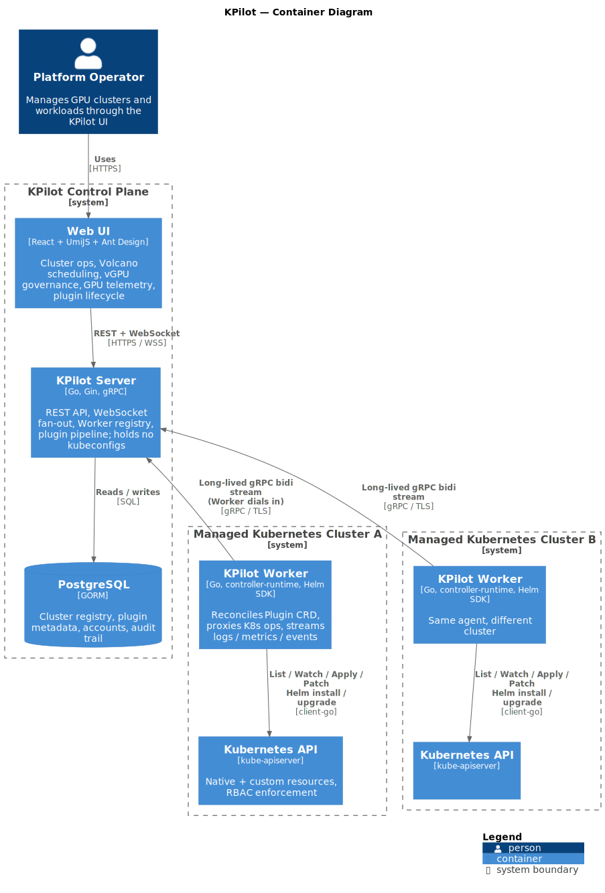

# KPilot

**Unified GPU + model platform for Kubernetes.**

[English](README.md) · [中文](README.zh-CN.md)

---

## What is KPilot

KPilot is a control plane for running GPU workloads on Kubernetes. Cluster operations, Volcano-based batch scheduling, vGPU governance, hardware telemetry, plugin lifecycle, and model serving live behind one console with a consistent permission and audit surface.

Multi-cluster is the default — a single KPilot Server manages many clusters, with the in-cluster agent dialing back over gRPC. No inbound ports on the cluster side, no shared kubeconfigs, no per-cloud divergence.

## Use Cases

- **Multi-cluster GPU operations** — run a single platform team across clusters in different VPCs, regions, or clouds without touching network policies.
- **Shared GPU tenancy** — partition each card into vGPU slices and govern allocation through Volcano queues with explicit capability / guarantee / deserved policies.
- **GPU usage metering** — produce GPU-Hour reports per node and per card straight from DCGM, then drill into hotspots from the same UI.
- **Self-service AI platform** *(roadmap)* — let teams deploy inference endpoints from a model catalog and run distributed fine-tuning without writing YAML.

## Key Features

### Cluster Management
- Multi-cluster onboarding via a single-use token; no kubeconfig sharing
- Live node and workload browser covering native and custom resources
- In-browser Pod logs, terminal, and per-container CPU / memory metrics
- Inline YAML editor with apply / describe / delete for any resource

### Compute Scheduling
- Volcano gang scheduling across Queue, Job, CronJob, PodGroup, HyperNode
- Fine-grained GPU sharing via volcano-vgpu-device-plugin (slot / framebuffer / SM cores)
- Multi-resource queue quotas with capability, guarantee, allocated, and deserved views
- Visual scheduler-policy editor for actions, tiers, and plugin parameters

### GPU Observability
- Per-card panels for utilization, temperature, power, framebuffer, SM clock, tensor activity
- DCGM-driven GPU-Hour usage reports across 1h / 24h / 7d / 30d windows
- Alerting on DCGM XID, ECC, thermal, and framebuffer-pressure conditions
- vGPU view mapping every physical card to its current slice holders

### Plugin Management
- Built-in Helm registry covering Volcano, DCGM Exporter, VictoriaMetrics, VictoriaLogs, Grafana, Metrics Server, kube-state-metrics
- Per-cluster enable / disable / upgrade with the install log streamed live
- Bring-your-own charts with per-cluster values overrides
- The same plugin pipeline that powers customer workloads also bootstraps KPilot's own observability stack

## Architecture

  

**Server** owns the UI, the API, and durable state — cluster registry, plugin metadata, accounts. It holds no kubeconfigs; every live resource read or write is proxied through a Worker.

**Worker** runs inside each managed cluster, dials the Server over a single long-lived gRPC stream, and brokers Kubernetes traffic on its behalf. The model removes inbound network requirements on the cluster side and keeps cross-cloud topology invisible to operators.

Plugins ship as Helm charts and reconcile via an in-cluster CRD, with the Helm SDK executing where the cluster's RBAC actually lives.

## Roadmap — Model Serving

Coming in upcoming releases:

- Model repository with curated vLLM templates for Qwen, DeepSeek, Llama, and other open-weights families
- One-click inference deployment with a built-in chat playground
- OpenAI-compatible routing with canary and A/B controls
- Distributed fine-tuning on Volcano gang scheduling

## Quick Start

> Coming soon.
