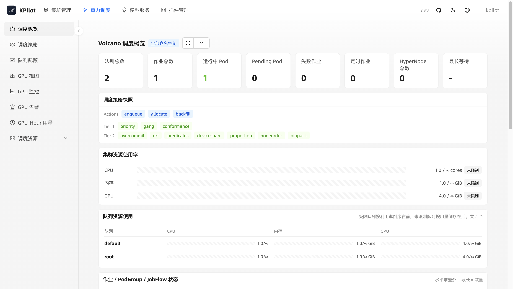
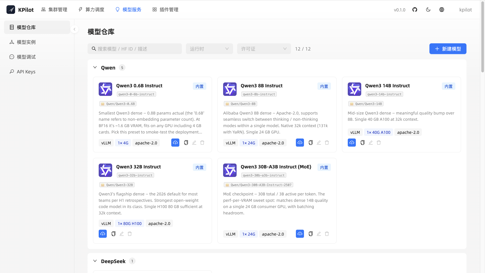
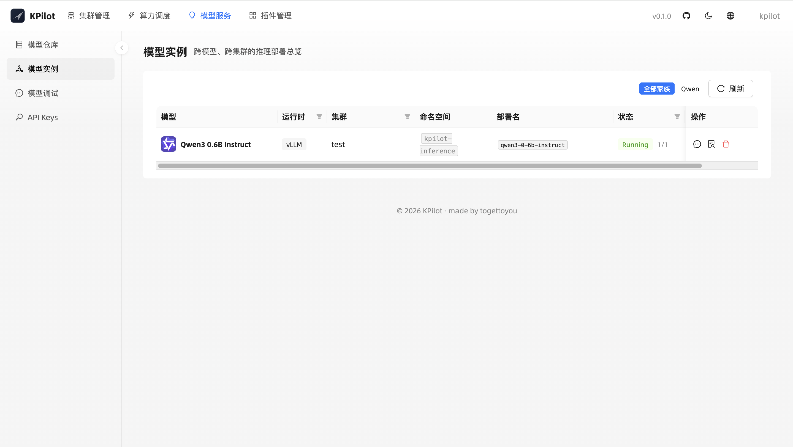
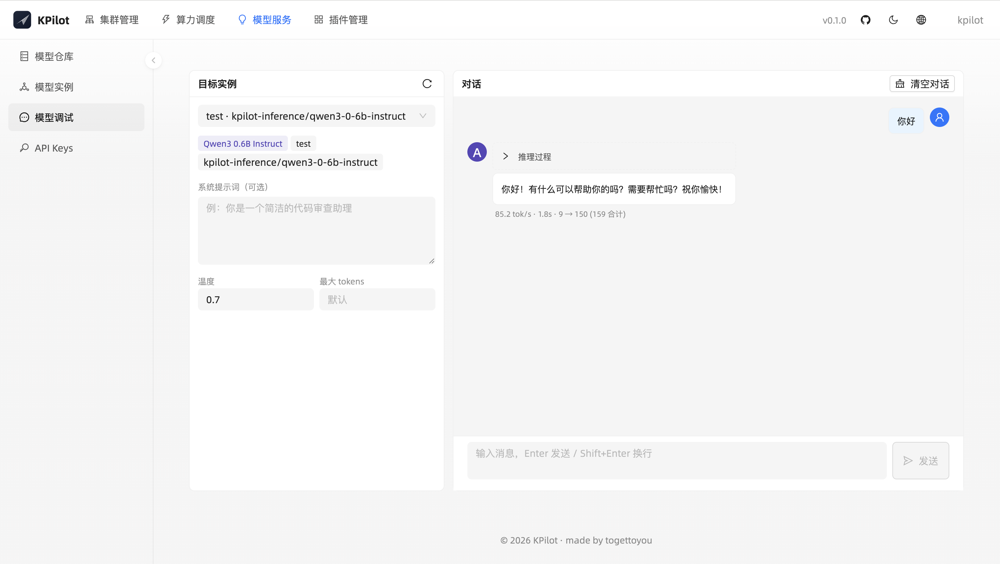
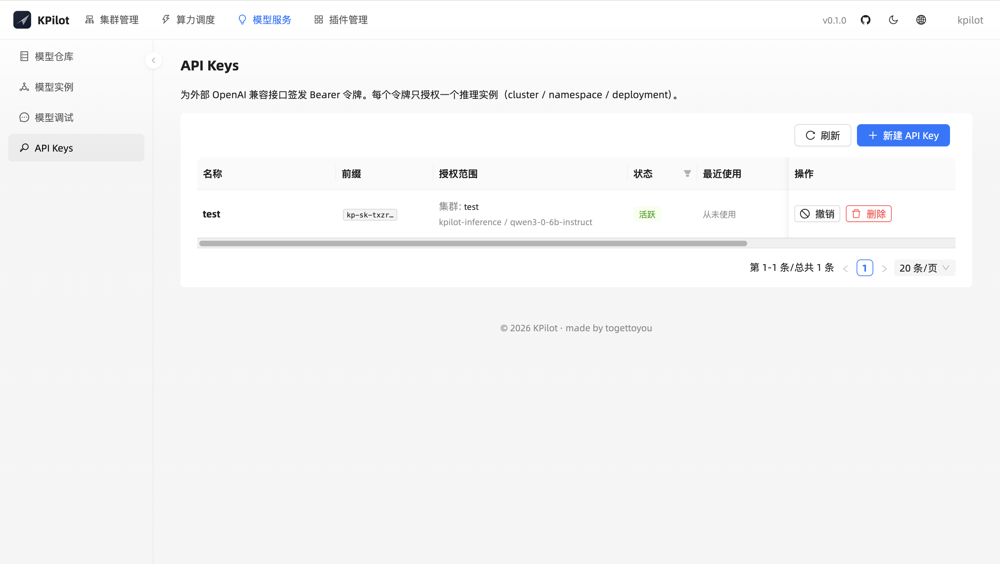

# KPilot

**Kubernetes 多集群管理 + GPU 算力调度 + 模型服务的一体化控制面。**

[English](README.md) · [中文](README.zh-CN.md)

<p align="center">
  <a href="https://github.com/togettoyou/kpilot/blob/main/LICENSE"></a>
  <a href="https://github.com/togettoyou/kpilot/stargazers"></a>
  <a href="https://github.com/togettoyou/kpilot/commits/main"></a>
  
</p>

---

## 什么是 KPilot

KPilot 是面向 Kubernetes 上 GPU 工作负载的控制面。集群运维、基于 Volcano 的批量调度、vGPU 治理、硬件遥测、插件生命周期、模型服务，全部在一个控制台中管理，共享一致的权限与审计层。

多集群是默认能力 —— 一个 KPilot Server 纳管多个集群，由集群内 Worker 主动通过单条长连接多路复用通道回连。集群侧无需开放入站端口、无需共享 kubeconfig、无需为不同云做差异化适配。

## 为什么是 KPilot

- **集群侧零入站端口，kubeconfig 永不出集群。** Worker 出方向连 Server，所有流量（K8s API 调用、Helm 安装、Pod 日志 / 终端、反向代理 Grafana / VictoriaMetrics / VictoriaLogs、推理 SSE 流）共享同一条多路复用通道，互不阻塞。

- **GPU + Volcano 一体化平台。** Volcano gang scheduling 覆盖 10 个 CR 类型，配类型化创建表单与可视化调度策略编辑器；vGPU 切片（slot / 显存 / SM 算力）按物理卡解析，列出当前持有每个切片的 Pod；DCGM 驱动的 GPU-Hour 用量报告（1h / 24h / 7d / 30d 窗口）+ XID / ECC / 温度 / 显存压力四类告警。

- **应用内模型服务，catalog 到 API 全链路。** 精选开源权重 LLM 一键部署（Qwen3、DeepSeek-R1、Llama-4、Mistral、Phi-4、GLM-5.1、Gemma-4、Kimi-K2.6 —— 默认 vLLM）到任意纳管集群，浏览器内 chat playground 调试每个实例，按部署签发受限范围的 OpenAI 兼容 Bearer 令牌给业务方使用。

- **Plugin-first 平台。** KPilot 自身的观测栈（VictoriaMetrics、VictoriaLogs、Grafana、DCGM Exporter、Metrics Server、kube-state-metrics）走的就是操作员用来安装任意客户 chart 的那条同一条内置 Helm 注册表流水线。按集群启用 / 禁用 / 升级；按集群覆盖 values；自定义 chart 同样接入。

## 架构

<p align="center">
  
</p>

**Server** 持有 UI、API 与持久化状态（集群注册表、插件元数据、账号、API 令牌、模型模板），**不保管任何 kubeconfig**。**Worker** 作为 Operator 部署在每个被纳管的集群中，通过单条长连接多路复用通道回连 Server，代为执行所有 Kubernetes 操作 —— 集群侧无入站端口、无共享凭据、跨云拓扑差异对运维不可见。插件以 Helm chart 形态分发，通过集群内 CRD 协调，Helm SDK 在集群本地 RBAC 上下文中执行。

## 快速开始

**一条命令起 Server + 本集群 Worker**（同时纳管自身的常见场景）：

```bash
helm install kpilot oci://ghcr.io/togettoyou/charts/kpilot \
  --version 0.0.0-dev \
  --namespace kpilot-system --create-namespace \
  --set server.admin.password='<请替换>' \
  --set worker.enabled=true
```

chart 自动生成共享 token、自动把 Worker 指向集群内的 transport Service，Server 启动时自动注册一个名为 `local` 的集群行。无需进 UI 手动创建条目，数秒后该集群即 Online。

转发端口并用 `kpilot` / `<你设的密码>` 登录：

```bash
kubectl -n kpilot-system port-forward svc/kpilot-server 8080:80
open http://localhost:8080
```

**可选：纳管远程集群**（每个被纳管集群一次）。先在 Server UI 中创建集群条目，复制一次性 ClusterToken 后，在目标集群上：

```bash
helm install kpilot-worker oci://ghcr.io/togettoyou/charts/kpilot \
  --version 0.0.0-dev \
  --namespace kpilot-system --create-namespace \
  --set server.enabled=false,worker.enabled=true,postgresql.enabled=false \
  --set worker.serverAddr='<Server transport 外部地址>:9090' \
  --set worker.clusterToken='<粘贴 token>'
```

生产暴露（Ingress、外部 Postgres、镜像仓库镜像）等细节见 [`deploy/README.md`](deploy/README.md)。

## 使用场景

- **多集群 GPU 运维** —— 平台团队跨 VPC、跨 Region、跨云管理多个集群，不需要协商网络策略。
- **GPU 共享租户** —— 把每张物理卡切成 vGPU 切片，通过 Volcano 队列以 capability / guarantee / deserved 策略治理分配。
- **GPU 用量计量** —— 从 DCGM 原始采样直接产出按节点 / 按卡的 GPU-Hour 报告，并在同一界面深入排查热点。
- **自助式 AI 推理** —— 业务团队从模型目录（Qwen3、DeepSeek、Llama-4…）一键把模型部署到任意纳管集群，浏览器 chat 调试，按部署签发受限范围的 OpenAI 兼容 Bearer 令牌给应用使用。

## 核心功能

| | |
|---|---|
| **集群管理**<ul><li>单 Token 一次性纳管，无需共享 kubeconfig</li><li>节点与工作负载实时浏览，覆盖原生与自定义资源</li><li>浏览器直接调取 Pod 日志、终端、按容器查看 CPU / 内存即时指标</li><li>内置 YAML 编辑器，对任意资源执行 apply / describe / delete</li><li>自绘集群监控与日志页，无需 Grafana iframe</li></ul> | **算力调度**<ul><li>基于 Volcano 的 gang scheduling，覆盖 Queue / Job / CronJob / PodGroup / HyperNode</li><li>借助 volcano-vgpu-device-plugin 实现 GPU 精细切片（按显存槽位、显存量、SM 算力）</li><li>多资源队列配额可视化（capability / guarantee / allocated / deserved 四维拆解）</li><li>调度策略可视化编辑器 —— actions、tier、plugin 参数全字段提示</li></ul> |
| **GPU 可观测性**<ul><li>物理卡级面板：利用率、温度、功耗、显存、SM 频率、Tensor 活动</li><li>节点/GPU 多选筛选、chart 阈值线、每图全屏放大</li><li>「需要关注的 GPU」自动高亮空闲 / 过热 / 显存告急，健康集群自动隐藏</li><li>基于 DCGM 的 GPU-Hour 用量报告，支持 1h / 24h / 7d / 30d 窗口</li><li>DCGM XID、ECC、温度、显存压力四类告警一站汇聚</li><li>vGPU 视图按物理卡列出当前持有切片的所有 Pod</li></ul> | **插件管理**<ul><li>内置 Helm 注册表 —— Volcano、DCGM Exporter、VictoriaMetrics、VictoriaLogs、Grafana、Metrics Server、kube-state-metrics 开箱即用</li><li>按集群启用 / 禁用 / 升级，安装日志实时流回 UI</li><li>支持自定义 chart，按集群覆盖 values</li><li>KPilot 自身的可观测性栈即由这条插件流水线启动</li></ul> |
| **模型服务**<ul><li>精选目录：Qwen3-0.6B/8B/14B/32B-Instruct、Qwen3-30B-A3B （MoE）、DeepSeek-R1、Llama-4-Scout-17B-16E （MoE）、Mistral-Small-3.2-24B、Phi-4、GLM-5.1、Gemma-4-31B、Kimi-K2.6 —— 默认 vLLM</li><li>一键部署到任意纳管集群，支持 `nvidia.com/gpu` 或 Volcano vGPU 资源精细切分</li><li>跨集群列表展示所有运行实例，逐行可调试 / Describe / 级联删除</li><li>浏览器内 chat playground：展示每轮 token/s、`<think>` 推理过程自动折叠、Markdown 渲染</li></ul> | **OpenAI 兼容网关**<ul><li>逐部署签发 Bearer 令牌（`kp-sk-…`），仅在创建时展示一次明文；sha256 哈希入库</li><li>端到端 SSE 流式 —— vLLM token 实时到达 SDK；客户端 Stop 立即取消上游调用</li><li>逐 Key 用量计量（prompt / completion / 调用数），计数可一键重置</li><li>令牌创建时二级 scope picker（集群 → 部署）防止 scope 错配</li><li>软撤销（保留审计行）+ 硬删除</li></ul> |
| **系统监控**<ul><li>实时观测 KPilot Server 与每个 Worker 的 Go runtime —— goroutines、heap、GC pause、调度延迟、CPU 与内存占用、文件描述符</li><li>控制面历史保留 1 天，范围选择器（1h / 3h / 6h / 12h / 24h 或自定义）内任意回看；Worker 掉线后仍可事后复盘</li><li>一键下载 pprof profile（heap / goroutine / CPU / allocs / block / mutex / trace），本机 `go tool pprof` 看火焰图</li><li>业务指标 —— yamux 会话与流（按集群拆分）、HTTP RPS / 5xx / p99 延迟、DB 连接池、SSE 客户端数、推理反代 in-flight</li><li>控制面自身的可观测性，不依赖 VictoriaMetrics / Grafana</li></ul> | |

## 效果展示

### 集群管理 —— [`docs/clusters.md`](docs/clusters.md)

<table width="100%">
<tr>
<td width="50%"></td>
<td width="50%"></td>
</tr>
<tr>
<td width="50%"></td>
<td width="50%"></td>
</tr>
</table>

### 算力调度 —— [`docs/compute.md`](docs/compute.md)

<table width="100%">
<tr>
<td width="50%"></td>
<td width="50%"></td>
</tr>
<tr>
<td width="50%"></td>
<td width="50%"></td>
</tr>
</table>

### 模型服务 —— [`docs/models.md`](docs/models.md)

<table width="100%">
<tr>
<td width="50%"></td>
<td width="50%"></td>
</tr>
<tr>
<td width="50%"></td>
<td width="50%"></td>
</tr>
</table>

### 插件管理 —— [`docs/plugins.md`](docs/plugins.md)

<table width="100%">
<tr>
<td width="50%"></td>
<td width="50%"></td>
</tr>
</table>
