# KPilot

**Kubernetes 上的 GPU + 模型一体化平台。**

[English](README.md) · [中文](README.zh-CN.md)

<p align="center">
  <a href="https://github.com/togettoyou/kpilot/blob/main/LICENSE"></a>
  <a href="https://github.com/togettoyou/kpilot/stargazers"></a>
  <a href="https://github.com/togettoyou/kpilot/commits/main"></a>
  
</p>

---

## 什么是 KPilot

KPilot 是面向 Kubernetes 上 GPU 工作负载的控制面。集群运维、基于 Volcano 的批量调度、vGPU 治理、硬件遥测、插件生命周期、模型服务，全部在一个控制台中管理，共享一致的权限与审计层。

多集群是默认能力 —— 一个 KPilot Server 纳管多个集群，由集群内 Worker 主动通过 gRPC 回连。集群侧无需开放入站端口、无需共享 kubeconfig、无需为不同云做差异化适配。

## 为什么是 KPilot

- **每集群一条反向连接的 gRPC 流。** Worker 出方向连 Server，集群侧无需开放入站端口，kubeconfig 不出集群。同一条流复用为 K8s API 代理、Helm chart blob、Pod 日志 / 终端、HTTP 与 WebSocket 反代（供 Grafana、VictoriaMetrics 等内嵌 UI 使用）。

- **Chunked 分片 + gzip 压缩 + 公平队列。** 大 payload（chart .tgz、describe 输出、log tail）按 ≤256 KiB 切片，gRPC stream 级 gzip 压缩（JSON 类响应 5–8× 缩减）；每条流单一 sender goroutine 先 drain Heartbeat fast lane，再对 per-request 子队列 round-robin 调度 —— 一个 20 MiB 日志响应不会 head-of-line block 同时发的 `/workloads/nodes` 小请求。活性判定独立走 gRPC HTTP/2 keepalive PING，与应用心跳解耦。

- **Volcano 深度对接。** 10 个 CR 浏览器，7 个类型化创建表单，调度策略可视化编辑器覆盖 Volcano 全部 action / tier / plugin 参数。vGPU 切片解析 device-plugin annotation，按物理卡列出当前持有切片的 Pod。

- **应用内自绘，Grafana 作为兜底入口。** 集群 / GPU 监控、日志搜索（虚拟列表 + 直方图）、队列配额条、vGPU 面板均在应用内直连 VictoriaMetrics / VictoriaLogs / DCGM 绘制。Grafana 单独路由保留给临时 PromQL 探索。

## 架构

<p align="center">
  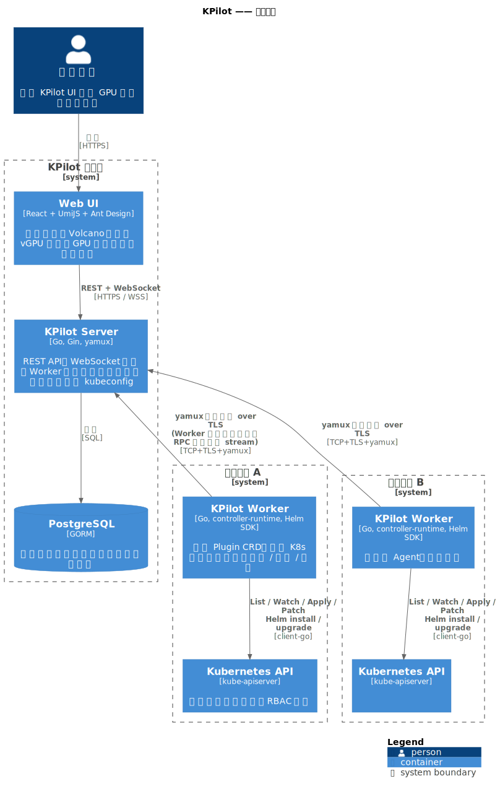
</p>

**Server** 持有 UI、API 与持久化状态（集群注册表、插件元数据、账号），**不保管任何 kubeconfig**。**Worker** 作为 Operator 部署在每个被纳管的集群中，通过单条长连 gRPC 流回连 Server 并代为执行所有 Kubernetes 操作 —— 集群侧无入站端口、无共享凭据、跨云拓扑差异对运维不可见。插件以 Helm chart 形态分发，通过集群内 CRD 协调，Helm SDK 在集群本地 RBAC 上下文中执行。

## 快速开始

**部署 Server**（控制面集群）：

```bash
helm install kpilot oci://ghcr.io/togettoyou/charts/kpilot \
  --version 0.0.0-dev \
  --namespace kpilot-system --create-namespace \
  --set server.admin.password='<请替换>'
```

转发端口并用 `kpilot` / `<你设的密码>` 登录：

```bash
kubectl -n kpilot-system port-forward svc/kpilot-server 8080:80
open http://localhost:8080
```

**部署 Worker**（每个被纳管集群一次）。在 UI 中创建集群条目，复制一次性 ClusterToken 后：

```bash
helm install kpilot-worker oci://ghcr.io/togettoyou/charts/kpilot \
  --version 0.0.0-dev \
  --namespace kpilot-system --create-namespace \
  --set server.enabled=false,worker.enabled=true,postgresql.enabled=false \
  --set worker.serverAddr='kpilot-server-grpc.kpilot-system.svc:9090' \
  --set worker.clusterToken='<粘贴 token>'
```

数秒后 Server UI 中该集群的状态会变为 Online。生产暴露（Ingress、外部 Postgres、镜像仓库镜像）等细节见 [`deploy/README.md`](deploy/README.md)。

## 使用场景

- **多集群 GPU 运维** —— 平台团队跨 VPC、跨 Region、跨云管理多个集群，不需要协商网络策略。
- **GPU 共享租户** —— 把每张物理卡切成 vGPU 切片，通过 Volcano 队列以 capability / guarantee / deserved 策略治理分配。
- **GPU 用量计量** —— 从 DCGM 原始采样直接产出按节点 / 按卡的 GPU-Hour 报告，并在同一界面深入排查热点。
- **自助式 AI 平台** *(规划中)* —— 业务团队从模型目录一键部署推理端点、提交分布式微调任务，无需手写 YAML。

## 核心功能

| | |
|---|---|
| **集群管理**<ul><li>单 Token 一次性纳管，无需共享 kubeconfig</li><li>节点与工作负载实时浏览，覆盖原生与自定义资源</li><li>浏览器直接调取 Pod 日志、终端、按容器查看 CPU / 内存即时指标</li><li>内置 YAML 编辑器，对任意资源执行 apply / describe / delete</li></ul> | **算力调度**<ul><li>基于 Volcano 的 gang scheduling，覆盖 Queue / Job / CronJob / PodGroup / HyperNode</li><li>借助 volcano-vgpu-device-plugin 实现 GPU 精细切片（按显存槽位、显存量、SM 算力）</li><li>多资源队列配额可视化（capability / guarantee / allocated / deserved 四维拆解）</li><li>调度策略可视化编辑器 —— actions、tier、plugin 参数全字段提示</li></ul> |
| **GPU 可观测性**<ul><li>物理卡级面板：利用率、温度、功耗、显存、SM 频率、Tensor 活动</li><li>基于 DCGM 的 GPU-Hour 用量报告，支持 1h / 24h / 7d / 30d 窗口</li><li>DCGM XID、ECC、温度、显存压力四类告警一站汇聚</li><li>vGPU 视图按物理卡列出当前持有切片的所有 Pod</li></ul> | **插件管理**<ul><li>内置 Helm 注册表 —— Volcano、DCGM Exporter、VictoriaMetrics、VictoriaLogs、Grafana、Metrics Server、kube-state-metrics 开箱即用</li><li>按集群启用 / 禁用 / 升级，安装日志实时流回 UI</li><li>支持自定义 chart，按集群覆盖 values</li><li>KPilot 自身的可观测性栈即由这条插件流水线启动</li></ul> |

## 效果展示

### 集群管理 —— [`docs/clusters.md`](docs/clusters.md)

<table width="100%">
<tr>
<td width="50%">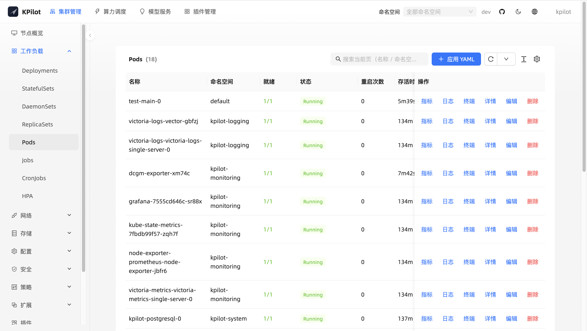</td>
<td width="50%">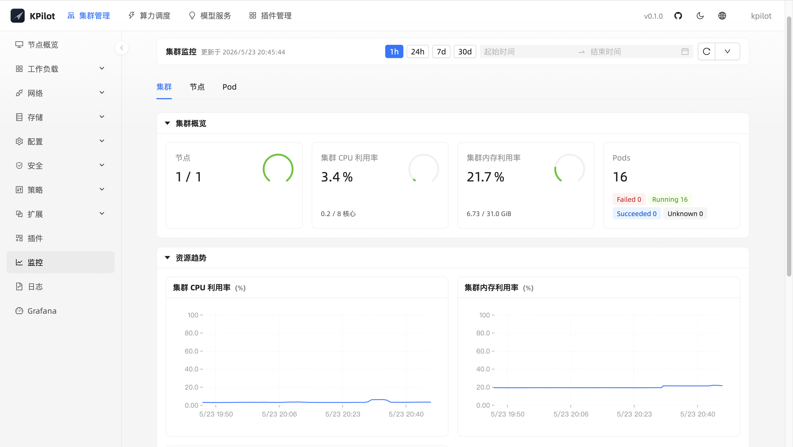</td>
</tr>
<tr>
<td width="50%">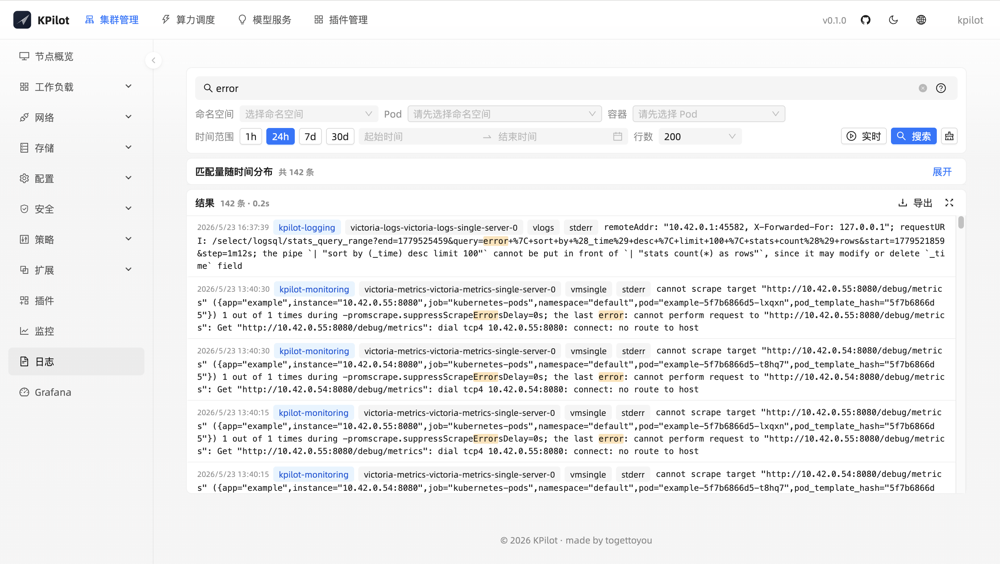</td>
<td width="50%">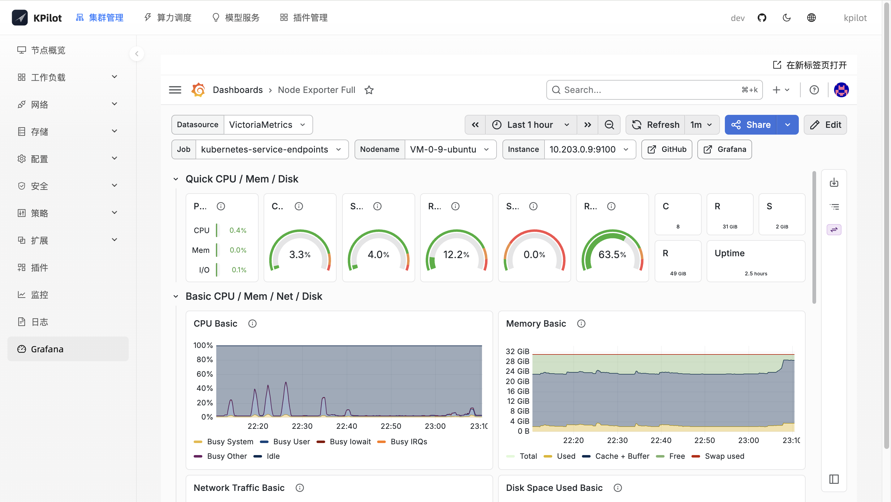</td>
</tr>
</table>

### 算力调度 —— [`docs/compute.md`](docs/compute.md)

<table width="100%">
<tr>
<td width="50%">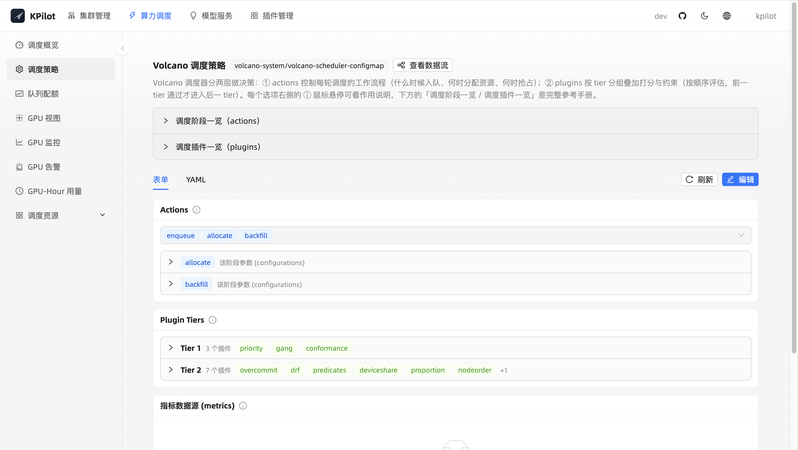</td>
<td width="50%">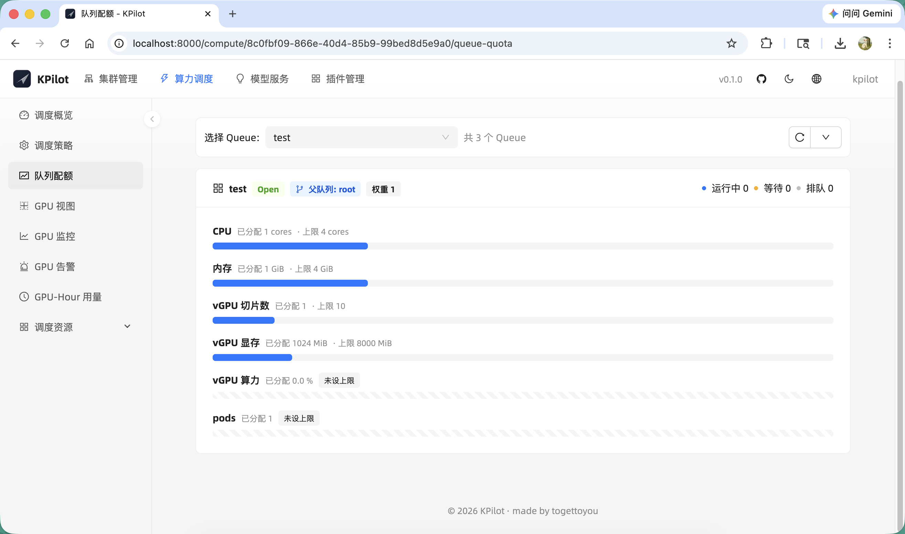</td>
</tr>
<tr>
<td width="50%">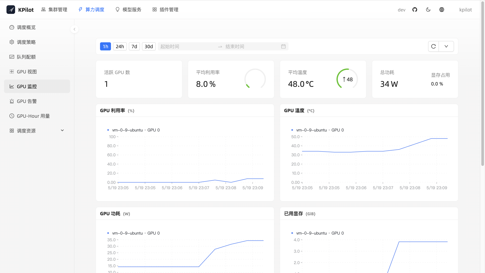</td>
<td width="50%">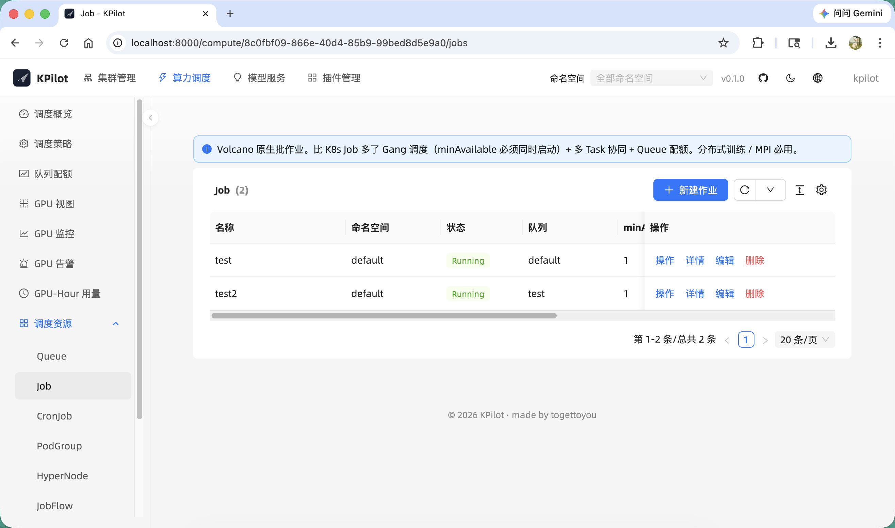</td>
</tr>
</table>

### 插件管理 —— [`docs/plugins.md`](docs/plugins.md)

<table width="100%">
<tr>
<td width="50%">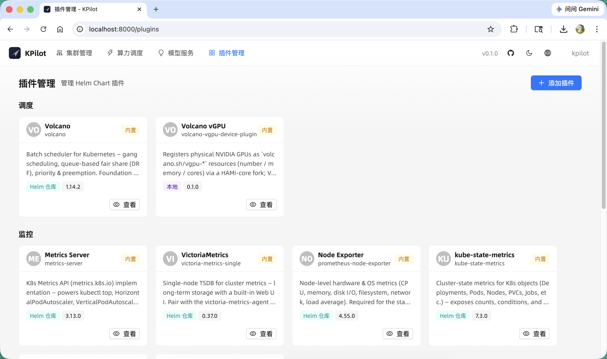</td>
<td width="50%">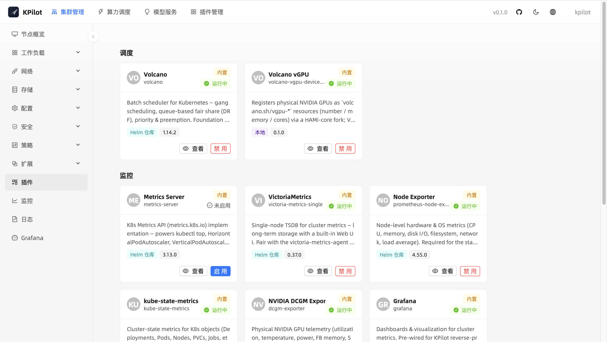</td>
<td width="50%"></td>
</tr>
</table>

## 演进路线 —— 模型服务

后续版本规划：

- 模型仓库，内置 Qwen / DeepSeek / Llama 等开源权重的 vLLM 启动模板
- 一键部署推理服务，附带 chat 调试面板
- OpenAI 兼容路由，支持灰度与 A/B 控制
- 基于 Volcano gang scheduling 的分布式 fine-tune
